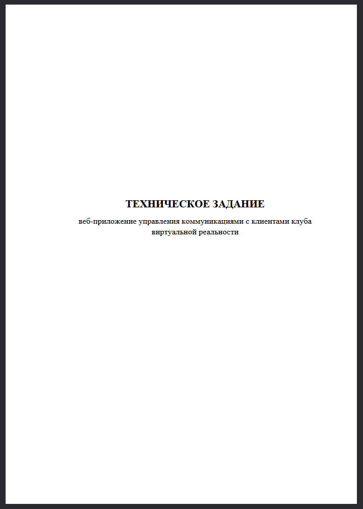
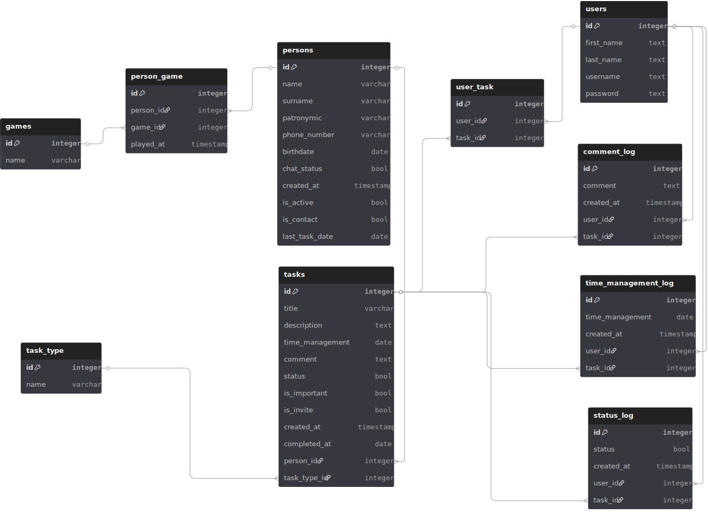
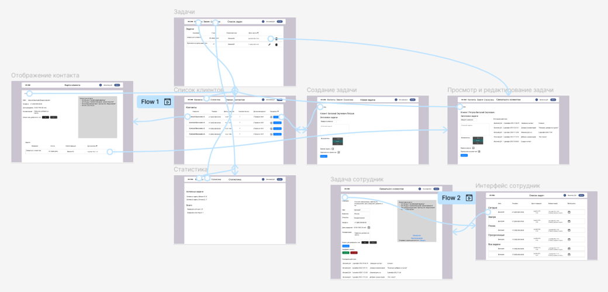

# VR Relations Web App

Заказное веб-приложение управления коммуникациями с клиентами для отдела продаж клуба виртуальной реальности.  

В данном репозитории размещено техническое задание на разработку ПО без титульного листа, схема базы данных, макеты пользовательских интерфейсов, само приложение и инструкция к запуску.   

В конечном итоге от интеграции приложения в работу руководство отказалось, отдав предпочтение компании которая занимается продвижением бизнеса со своей системой. Все данные вымышлены. 

## Технологический стек
- Python 3.10
- Django 5.1.2
- django-import-export 4.3.3
- Django Ninja 1.3.0
- PostgreSQL 16
- jQuery 3.6.4
- Bootstrap 5.3.3
- Docker / Docker Compose

## Запуск приложения
1. Склонировать репозиторий:
```bash
git clone https://github.com/ShuraShved/django-postgres-portfolio.git
cd django-postgres-portfolio
```
 
2. Собрать и запустить контейнеры (база данных + Django-приложение):
```bash
docker compose up --build
```
 
3. Применить миграции и загрузить демонстрационные данные:
```bash
docker compose exec web python manage.py migrate
docker compose exec web python manage.py loaddata demo_data.json
```
 
4. Открыть в браузере:
```
http://localhost:8000
```
 
## Тестовые аккаунты
 
| Роль                   | Логин | Пароль      | Что видно                                            |
|------------------------|---|-------------|------------------------------------------------------|
| Системный администратор | `admin` | `admin`     | Страницы руководителя, сотрудника, django admin panel |
| Руководитель           | `Игорь` | `demo112233` | Страницы руководителя, сотрудника                    |
| Сотрудник              | `Евгений` | `demo445566` | Страницы сотрудника      |
| Сотрудник      | `Виталий` | `demo778899` | Страницы сотрудника       |
 
## Пути
 
- `/admin/` — Административная панель Django (системный администратор).
- `/api/docs` — Swagger API документация.
- `/home/manager/contacts/` — список клиентов (руководитель).
- `/home/manager/tasks/` — список задач (руководитель).
- `/home/manager/statistics/` — статистика (руководитель).
- `/home/tasks/` — список задач (сотрудник).


## Техническое Задание на разработку ПО

[](docs/Software_Requirements_Specification.pdf)


## Схема базы данных




## Макеты UI



